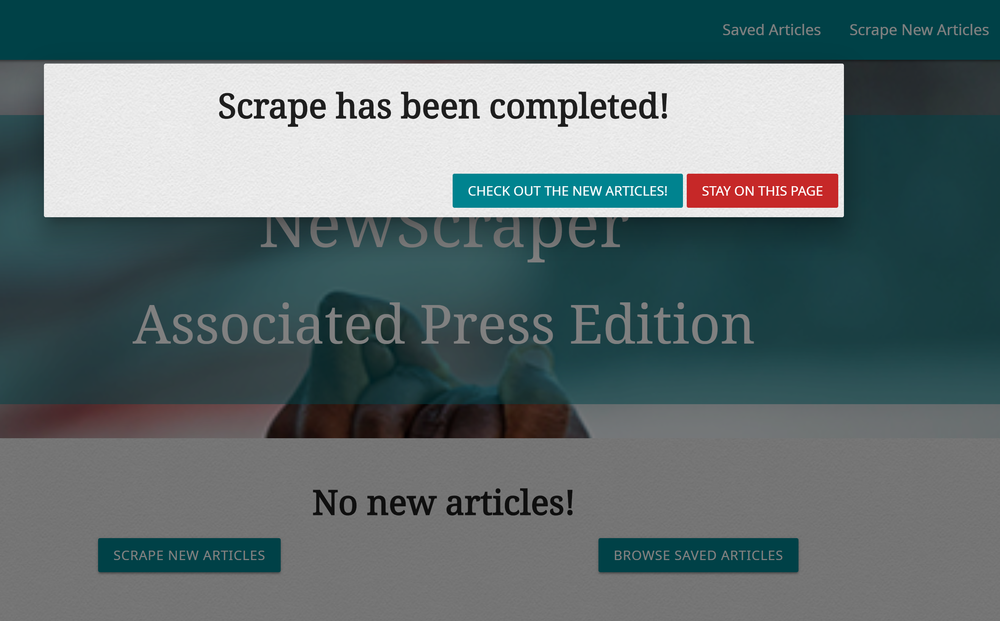
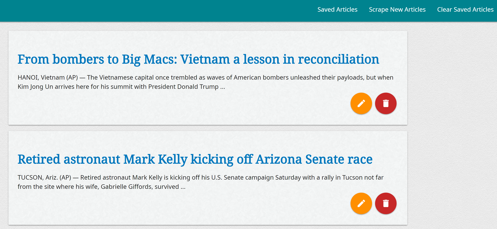
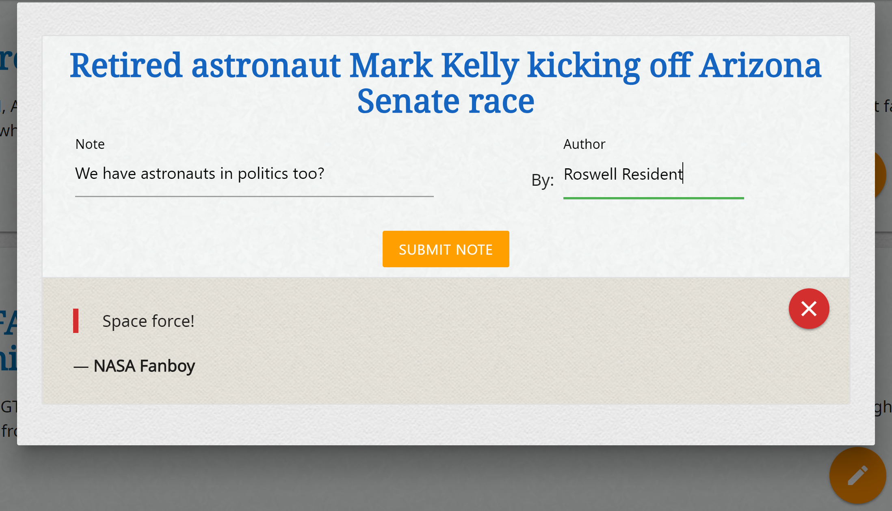

# NewScraper

[NewScraper](https://newscraper-ap.herokuapp.com/) is a web app for scraping news articles straight from the [Associated Press](https://www.apnews.com/).

## Instructions

### Scraping New Articles

1. To load some articles, click **Scrape New Articles**.
2. Click on **Check out the new articles!** to go to the [Home](https://newscraper-ap.herokuapp.com/) to see the new articles from the Associated Press.
3. Click on **Stay on this page** to stay on the current page.

### Saving Articles

1. To save an article from the [Home](https://newscraper-ap.herokuapp.com/) page, click on the blue *bookmark* icon.
2. The newly saved article is removed from the main news feed and moved to the [Saved Articles](https://newscraper-ap.herokuapp.com/saved) page.

### Deleting Articles

1. To delete a saved article, click on the red *delete* icon.
2. The article deleted will be removed from the NewScraper database.
3. To clear *all* articles from the database, click **Clear Saved Articles**.
4. All articles in the NewScraper database will be removed from both saved articles and the home page.

### Commenting on Articles

1. To open the notes on a saved article, click on the orange *edit* icon.
2. To add a new note:
    1. Fill out the *Note* field
    2. Fill out the *Author* field.
    3. Click **Submit Note**.
3. The note is then added to any other notes on the article.
4. To delete a note, click on the red *close* icon to the top right of the note.
